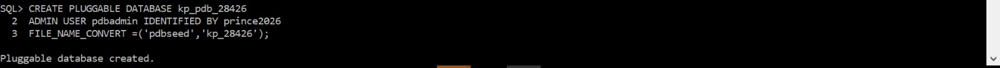
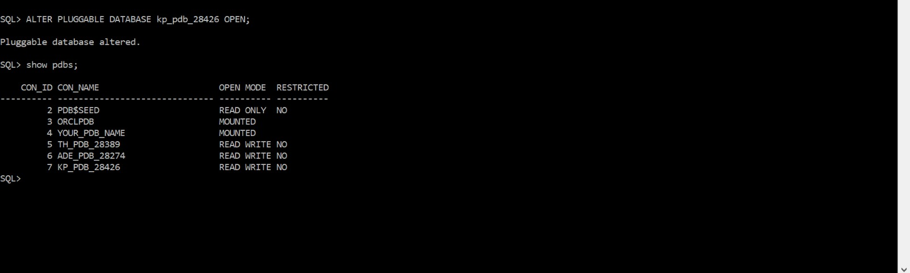
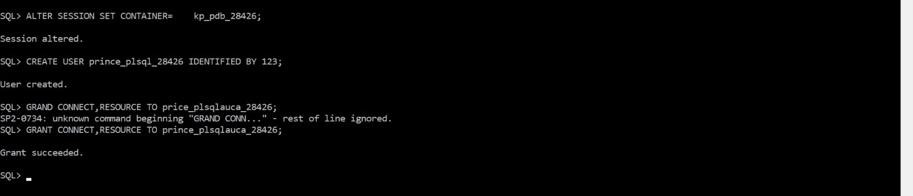
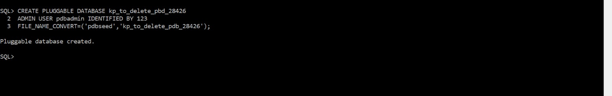
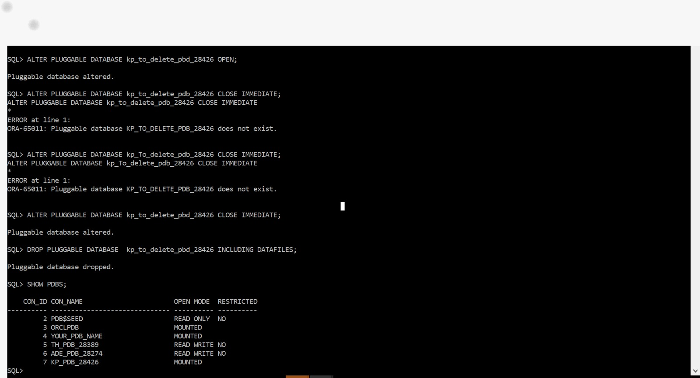
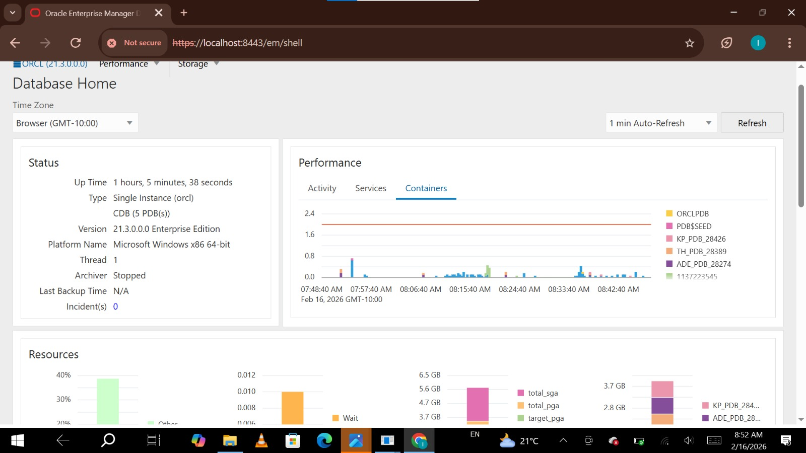

# Oracle Pluggable Database Assignment II

## Student Information
- **Name:** Prince
- **Student ID:** 28426
- **Course:** Database Development with PL/SQL (INSY 8311)
- **Instructor:** Eric Maniraguha
- **Date:** February 2026

---

## Oracle Environment
- **Database Version:** Oracle Database 21c
- **Operating System:** Windows 11 64-bit
- **CDB Name:** ORCL
- **Tool Used:** SQL*Plus

---

## Task 1: Create Personal Pluggable Database
- **PDB Name:**  kp_pdb_28426
- **Username Created:** prince_plsqlauca_28426
- Created the PDB successfully from CDB$ROOT
- Opened the PDB and created a user with CONNECT, RESOURCE, DBA privileges

### Screenshots

---

## Task 2: Create and Delete Temporary PDB
- **Temporary PDB Name:** kp_to_delete_pdb_28426
- Created the temporary PDB successfully
- Verified it existed using SELECT from DBA_PDBS
- Closed and dropped the PDB including all datafiles
- Confirmed deletion by querying DBA_PDBS again

### Screenshots

---

## Task 3: Oracle Enterprise Manager (OEM)
- Accessed OEM dashboard via https://localhost:5500/em
- Dashboard shows Oracle environment and completed PDB tasks

### Screenshots

---

## Task 4: Documentation
- All tasks documented in this README
- All screenshots uploaded in this repository
- Repository is public

---

## Challenges Faced
No major challenges encountered

---

## Integrity Statement
I confirm that all work in this repository is my own.
I did not copy commands, screenshots, or solutions from any classmate.
I did not use AI tools to generate my commands or solutions.
All tasks were performed and documented by me individually.

**Name:** Prince
**Date:** February 2026
